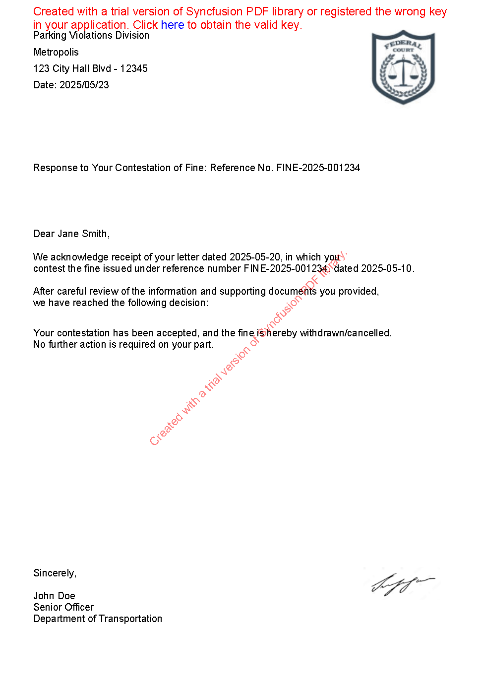

   # 🧾 Contestation API

A RESTful ASP.NET Core Web API for generating dynamic PDF responses to contestations (e.g., traffic fines), using data stored in MongoDB and Syncfusion's PDF library.

---

## 📌 Features

- 📝 PDF generation based on dynamic templates
- 📄 MongoDB integration using generic repositories
- ✅ Validation layer for consistency checks
- 🔧 Scalable and clean service/repository architecture
- 🚀 Swagger-enabled for API testing
- 🛠 Dependency injection with scoped services
- 🔐 JWT-based authentication for secure access control
---
🖥️ WPF UI Client

This project includes a **WPF (Windows Presentation Foundation)** desktop application that acts as a client to the Contestation API. It demonstrates token-based authentication, data fetching, filtering, and inline PDF preview functionality.
## 🗂 Project Structure

ContestationApi/
│
├── Controllers/ # API endpoints
├── Infra/
│ ├── Bootstrapper/ # Service registration
│ ├── Dtos/ # Data Transfer Objects
│ ├── Enum/ # Enums for business logic
│ ├── Helpers/ # PDF and validation utilities
│ ├── Models/ # MongoDB models and options
│ ├── Repositories/ # Mongo repository pattern (interfaces & implementations)
│ └── Services/ # Core PDF generation services
├── Program.cs # App configuration and pipeline
├── appsettings.json # MongoDB config & logging
└── README.md # You're here :)


---

## 🔧 Technologies Used

- **.NET 7/8** (ASP.NET Core Web API)
- **MongoDB** (NoSQL Database)
- **Syncfusion.Pdf** (PDF generation)
- **Swashbuckle (Swagger)** (API documentation)
- **Dependency Injection** (built-in via IServiceCollection)

---
Example: 

## ⚙️ Getting Started

### 1. Clone the repository

```bash
git clone https://github.com/your-username/contestation-api.git
cd contestation-api

2. Configure the database

Edit appsettings.json:

"ConnectionStrings": {
  "MongoDatabase": "<your-connection-string>",
  "CollectionName": "ContestationDB",
  "Issuer": "Issuer",
  "Opposer": "Opposer",
  "Response": "Response",
  "ResponseBody": "ResponseBody"
}

3. Install dependencies

Make sure you have .NET SDK installed (>= 7.0):

dotnet restore

4. Run the project

dotnet run

Visit: https://localhost:<port>/swagger to test the API.
🚀 API Endpoint
GET /Pdf?fineNumber=<FINE_NUMBER>

Returns a base64-encoded PDF response for the specified fine.

Response:

{
  "errors": [],
  "pdfByteArray": "JVBERi0xLj..."
}

📦 Dependency Injection

services.AddScoped<IMongoRepository<Opposer>, MongoRepository<Opposer>>();
services.AddScoped<IPdfService, PdfService>();

All repositories and services are registered in Infra.Bootstrapper.ConfigurationExtensions.
🧪 Sample Usage Flow

    Insert contestation data into MongoDB (Opposer, Issuer, Response, etc.)

    Call GET /Pdf?fineNumber=12345

    Receive PDF in base64, decoded client-side

✅ TODO

Unit and integration tests

Role-based auth

Admin dashboard for manual data entry
